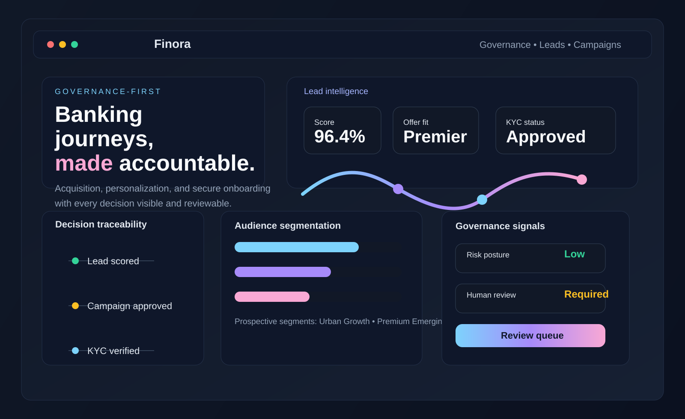
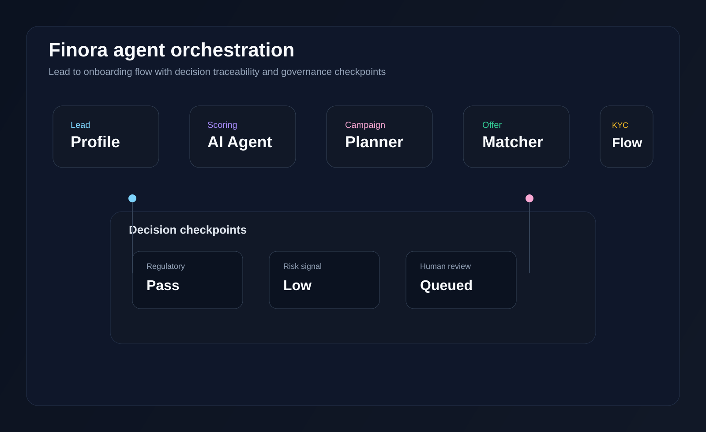

# Finora

Finora is a governance-first, agentic AI platform for digital banking acquisition and onboarding. It helps banks identify high-potential leads, recommend personalized offers, orchestrate marketing journeys, and keep every decision traceable, explainable, and reviewable.

The product is designed for modern financial institutions that want AI-driven growth without losing control over compliance, operational oversight, and customer trust.

## Live demo

- Vercel: https://agentic-ai-customer-acquisition.vercel.app/
- GitHub: https://github.com/kunalchoubey1108-png/Finora.git

## Why Finora

Finora turns the banking acquisition journey into an accountable workflow that blends:

- AI-powered lead intelligence and risk-aware scoring
- Campaign and offer optimization by customer segment
- Personalized outreach messaging and content generation
- Secure, staged onboarding flows with Video KYC checks
- Governance, audit trails, and human review escalation

Instead of treating AI as a black box, Finora exposes its reasoning so teams can monitor confidence, review interventions, and escalate exceptions when needed.

## Product overview

Finora provides a simulated, end-to-end acquisition flow for banks and financial institutions. It covers the journey from lead discovery to approval and onboarding, including key operational views for:

- Lead intelligence and segmentation
- Campaign optimization and budget allocation
- Offer personalization and recommendation logic
- Content studio and outbound messaging
- Agent orchestration and decision flow
- Governance and auditability
- Video KYC assessment and review
- Call-center assisted customer journeys

## Screenshots

### Dashboard overview



### Agent orchestration flow



### Governance and KYC control center


## Key features

- Multi-stage bank acquisition workflow with human-review pathways
- Lead scoring using business value, product fit, onboarding confidence, and compliance risk
- Offer and campaign personalization by customer segment and persona
- Explainable decision records, audit timelines, and governance signals
- Video KYC simulation with exception handling and reviewer actions
- Bank-configurable demo experiences through a switchable bank registry
- Call-center support flows and outreach orchestration
- Unbranded showcase and tailored deployment request experiences

## Tech stack

- Next.js 14
- React 18
- TypeScript
- Tailwind CSS
- App Router API routes
- Synthetic data and orchestration services for banking workflows

## Project structure

```text
.
├── app/                     # App Router pages and API routes
├── components/              # Reusable UI and workflow components
├── data/                    # Synthetic leads, campaigns, templates, and product data
├── lib/                     # Domain logic, scoring, orchestration, and governance services
├── public/
│   └── screenshots/         # Product screenshot assets used in this README
├── calle-skill/             # CALL-E related skill assets and notes
├── package.json             # Project metadata and scripts
├── README.md                # Project overview and setup guide
├── next.config.mjs          # Next.js configuration
├── tailwind.config.ts       # Tailwind styling configuration
├── tsconfig.json            # TypeScript configuration
└── .env.example             # Example environment configuration
```

## Getting started

### Prerequisites

- Node.js 22+
- npm

### Install dependencies

```bash
npm install
```

### Run locally

```bash
npm run dev
```

Then open the local URL shown by Next.js, usually:

```text
http://localhost:3000
```

### Production build

```bash
npm run build
npm run start
```

## Environment configuration

Copy the example environment file if needed:

```bash
cp .env.example .env.local
```

This project supports optional call-center and external integration configuration for CALL-E based interactions. Demo flows work without live credentials, while live execution paths rely on environment-specific values.

## Demo journeys

The app includes multiple product experiences:

- `/` — main Finora acquisition and orchestration overview
- `/agent-flow` — execution trace and workflow analysis
- `/lead-intelligence` — lead scoring and customer insights
- `/campaign-optimization` — campaign strategy and spend simulation
- `/offer-personalization` — recommendation and explanation views
- `/content-studio` — message variants and delivery planning
- `/governance` — compliance and review signals
- `/kyc-studio` — onboarding and Video KYC workflow
- `/call-center` — customer support and outreach tools
- `/showcase` — product showcase without bank branding
- `/tailored-banking` — bank deployment request form

## Why this matters

Banks increasingly need AI systems that help accelerate acquisition while preserving regulatory accountability. Finora is built for that balance: faster decisions, better personalization, clearer audits, and stronger control for operational teams.

## License

This project currently does not include a dedicated license file. Please confirm repository licensing requirements before commercial deployment or redistribution.
